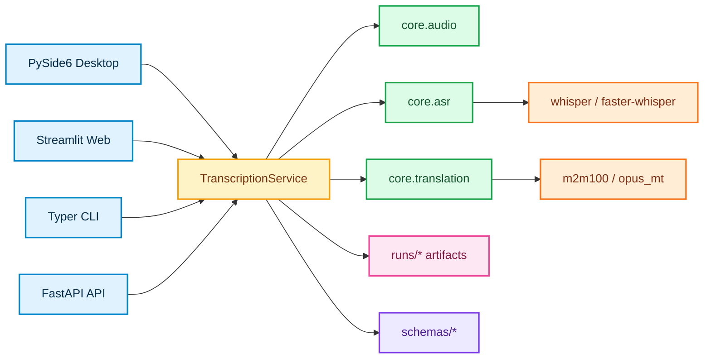
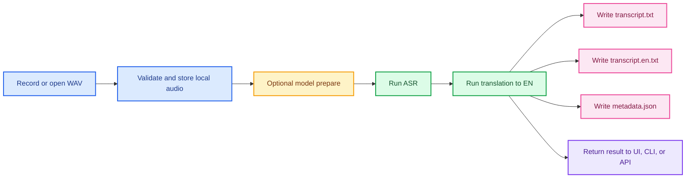
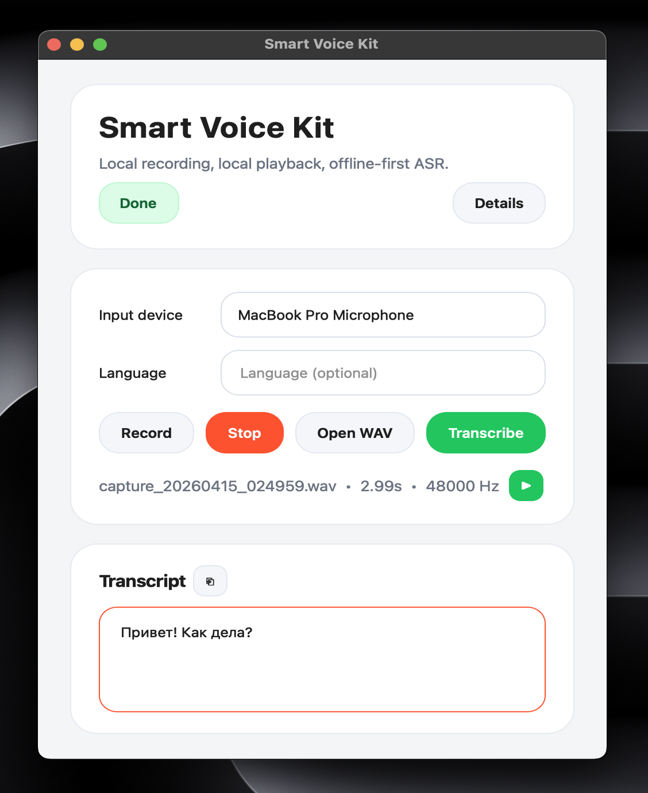
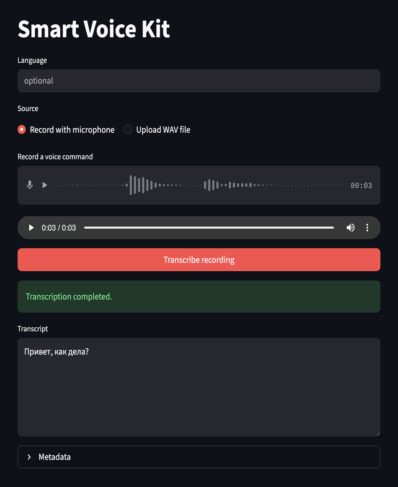

<div align="center">
  <h1>iVoice</h1>
  <p><strong>Instruction-driven speech foundation with local audio capture, transcription, and reusable runtime artifacts</strong></p>

  <p>
    <a href="https://www.python.org/">
      
    </a>
    <a href="https://github.com/SYSTRAN/faster-whisper">
      
    </a>
    <a href="./config.toml">
      
    </a>
    <a href="./LICENSE">
      
    </a>
  </p>

  <p>
    <a href="https://doc.qt.io/qtforpython-6/">
      
    </a>
    <a href="https://streamlit.io/">
      
    </a>
    <a href="https://fastapi.tiangolo.com/">
      
    </a>
    <a href="https://typer.tiangolo.com/">
      
    </a>
    <a href="https://www.uvicorn.org/">
      
    </a>
  </p>
  
</div>

## Overview

`iVoice` is a local-first project for **instruction-driven speech systems**.

The long-term goal is controllable speech synthesis from natural-language directions such as "say this like an old man who is short of breath and in a hurry". The current repository implements the production-ready **capture and speech-analysis layer** for that vision:

- recording reference speech from a microphone
- loading and validating local WAV files
- offline-friendly transcription with `faster-whisper`
- local translation to English through `m2m100` or `opus_mt`
- persistent run artifacts in `runs/`
- one shared service layer for desktop, web, CLI, and API clients
- pluggable model families and providers for ASR and translation

This is not a finished TTS product yet. It is the clean, reusable base that an instructive synthesis system can be built on top of.

## What iVoice Does Today

- Runs local transcription through `faster-whisper`
- Runs local translation to English through configurable translation families
- Saves every run as `input.wav`, `transcript.txt`, `transcript.en.txt`, and `metadata.json`
- Supports four client surfaces: desktop, web, CLI, and HTTP API
- Keeps runtime configuration in `config.toml`
- Resolves storage and model paths automatically relative to the config file
- Prepares concrete ASR and translation models for offline work

## Functional Areas

| Area | Concrete coverage |
| --- | --- |
| Audio input | Microphone capture in desktop and web clients, plus local `.wav` ingestion |
| Speech analysis | Whisper ASR via `faster-whisper` plus local translation through `m2m100` or `opus_mt` |
| Persistence | Per-run storage of source audio, plain-text transcript, and structured metadata |
| Interfaces | PySide6 desktop app, Streamlit web app, Typer CLI, and FastAPI service |
| Configuration | Centralized `config.toml` with path resolution relative to config location |
| Extensibility | Stable `family -> provider -> model` contracts for ASR and translation runtimes |

## Architecture



## Runtime Flow



The important design choice is simple: all interfaces talk to the same service layer, so early research work does not turn into throwaway code later.

## Quick Start

The recommended setup path is the project helper script.

```bash
source setup.sh base
ivoice-install-model configured
ivoice-desktop
```

For development dependencies as well:

```bash
source setup.sh dev
```

`setup.sh` creates `.venv`, installs the project in editable mode, and activates the environment in the current shell. The script must be executed with `source`, not as a standalone process.

## Installation

Recommended profiles through `setup.sh`:

```bash
source setup.sh base
source setup.sh desktop
source setup.sh web
source setup.sh api
source setup.sh dev
```

Profile mapping:

- `base` -> full local runtime: `asr,translation,desktop,web,api`
- `desktop` -> desktop app stack: `asr,translation,desktop`
- `web` -> Streamlit stack: `asr,translation,web`
- `api` -> FastAPI stack: `asr,translation,api`
- `dev` -> full runtime plus lint tooling

Manual editable install for the full runtime:

```bash
python3 -m venv .venv
source .venv/bin/activate
pip install -e ".[asr,translation,desktop,web,api]"
```

Manual editable install for development:

```bash
python3 -m venv .venv
source .venv/bin/activate
pip install -e ".[asr,translation,desktop,web,api,dev]"
```

Minimal examples:

```bash
# CLI + ASR + translation only
pip install -e ".[asr,translation]"

# Desktop-only local app
pip install -e ".[asr,translation,desktop]"

# HTTP API only
pip install -e ".[asr,translation,api]"
```

## Model Installation

`iVoice` keeps model installation separate from transcription. Downloading or verifying local caches is done only through `ivoice-install-model`; `ivoice-cli` does not install models on its own.

All prepared model files are stored under `data/models/<task>/<family>/...`.

Translation runtime depends on PyTorch, `transformers`, `sentencepiece`, and `sacremoses`, so after pulling updates you should reinstall the environment with `source setup.sh base` or `pip install -e ".[asr,translation,desktop,web,api]"`.

Install everything declared in [`config.toml`](./config.toml):

```bash
ivoice-install-model configured
```

Redownload configured model files from scratch:

```bash
ivoice-install-model configured --force
```

Install a Whisper ASR model for local speech recognition:

```bash
ivoice-install-model asr \
  --family whisper \
  --provider faster_whisper \
  --model-name base
```

Install a larger Whisper variant:

```bash
ivoice-install-model asr \
  --family whisper \
  --provider faster_whisper \
  --model-name small
```

Install `M2M100 418M` for translation into English:

```bash
ivoice-install-model translation \
  --family m2m100 \
  --provider transformers \
  --model-name facebook/m2m100_418M \
  --target-language en
```

Install `OPUS-MT` for a concrete language pair such as Russian -> English:

```bash
ivoice-install-model translation \
  --family opus_mt \
  --provider transformers \
  --model-name Helsinki-NLP/opus-mt-ru-en \
  --source-language ru \
  --target-language en
```

For `opus_mt`, the source pair can be inferred from the model name itself, so `Helsinki-NLP/opus-mt-ru-en` is treated as `ru -> en` even if `source_language` is left empty in `config.toml`.

Use a custom config during installation:

```bash
VOICE_APP_CONFIG=/path/to/config.toml ivoice-install-model configured
```

## Requirements

- Python `3.11+`
- macOS or Linux
- `ffmpeg` recommended for `faster-whisper`
- Internet access is required once to download ASR model assets if they are not already cached locally

## Running

### Desktop UI

```bash
ivoice-desktop
```

Desktop features:

- microphone recording
- local WAV opening and playback
- transcript copy action
- runtime details panel
- automatic ASR preparation on first transcription if the local model cache is missing

### Web UI

```bash
ivoice-web
```

The Streamlit app supports microphone recording or WAV upload and uses the same local service layer as the desktop application.

### CLI

```bash
ivoice-cli transcribe-file /path/to/audio.wav
ivoice-cli transcribe-last
```

### HTTP API

```bash
ivoice-api
curl http://127.0.0.1:8000/health
curl -X POST "http://127.0.0.1:8000/transcribe/file?language=ru" \
  -F "file=@/path/to/audio.wav"
```

## Configuration

Runtime settings live in [`config.toml`](./config.toml). You can also point the app to a custom config with `VOICE_APP_CONFIG=/path/to/config.toml`.

The shipped config is heavily commented so each field documents its runtime contract, storage location, and expected value shape. The most important rule is consistency across the pipeline:

- ASR and translation both use normalized language labels such as `ru`, `en`, `sv`
- model caches live under `data/models/<task>/<family>`
- a custom `model_path` overrides managed cache installation for that task

Key options:

| Key | Purpose |
| --- | --- |
| `app_name` | Application title used by clients and API health endpoint |
| `asr.family` | ASR model family, currently `whisper` |
| `asr.provider` | ASR runtime provider, currently `faster_whisper` |
| `asr.model_name` | Whisper model size such as `tiny`, `base`, `small` |
| `asr.model_path` | Path to a fully local converted `faster-whisper` model |
| `asr.local_files_only` | Enforces offline-only loading from local cache |
| `asr.download_root` | Cache directory for prepared ASR model files, usually `data/models/asr/<family>` |
| `asr.preload_on_startup` | Loads the ASR model during bootstrap |
| `translation.family` | Translation family, for example `m2m100` or `opus_mt` |
| `translation.provider` | Translation runtime provider, currently `transformers` |
| `translation.model_name` | Local translation model such as `facebook/m2m100_418M` |
| `translation.cpu_threads` | PyTorch CPU thread limit for translation inference; `0` keeps the runtime default |
| `translation.download_root` | Cache directory for translation model files, usually `data/models/translation/<family>` |
| `storage.runs_dir` | Persistent transcription runs |
| `storage.data_dir` | Root directory for local model assets and caches |
| `storage.samples_dir` | Optional directory for example inputs |
| `api.host`, `api.port` | HTTP API bind settings |

## Runtime Artifacts

Each transcription run is persisted into its own directory:

```text
runs/
  20260417_120102_ab12cd34/
    input.wav
    transcript.txt
    transcript.en.txt
    metadata.json
```

`metadata.json` stores the run id, timestamp, duration, sample rate, language, transcript, ASR backend, model name, and inference time. This makes `iVoice` useful not only as an app, but also as a dataset and evaluation substrate.

## Repository Layout

```text
smart-voice-kit/
|- app/                         # user-facing entrypoints
|  |- api/                      # FastAPI service
|  |- terminal_ui/              # Typer CLI
|  |- desktop_ui/               # PySide6 desktop app
|  `- web_ui/                   # Streamlit web app
|- core/                        # reusable domain primitives
|  |- audio/                    # audio IO and WAV inspection
|  |- asr/                      # ASR interfaces and faster-whisper engine
|  |- style/                    # future instruction parsing contract
|  `- tts/                      # future speech synthesis contract
|- services/                    # orchestration layer
|  |- transcription.py          # shared transcription workflow
|  `- asr_assets.py             # model preparation workflow
|- schemas/                     # Pydantic models
|  |- config.py                 # application settings
|  |- runtime.py                # ASR preparation result schema
|  `- transcription.py          # transcription and run schemas
|- assets/images/               # logo and UI screenshots
|- config.toml                  # runtime configuration
|- setup.sh                     # environment bootstrap script
`- pyproject.toml               # package metadata and dependencies
```

## Screenshots

<table align="center">
  <tr>
    <td align="center"><strong>Desktop UI</strong></td>
    <td align="center"><strong>Web UI</strong></td>
  </tr>
  <tr>
    <td></td>
    <td></td>
  </tr>
</table>

## Design Principles

- Build reusable infrastructure instead of milestone-only prototypes
- Keep clients thin and the service layer central
- Save structured artifacts for evaluation, analysis, and future training loops
- Prefer explicit interfaces where new ASR, style, or TTS backends may appear later
- Be precise about scope: current code is a strong foundation, not a finished synthesis engine

## Roadmap

- natural-language instruction parsing into structured speech controls
- optional normalization, resampling, and VAD hooks in the audio pipeline
- richer speaker and style metadata in transcription artifacts
- pluggable TTS engines behind `BaseTTSEngine`
- evaluation tooling for instruction faithfulness and speech quality

## License

This project is distributed under the [MIT License](./LICENSE).
