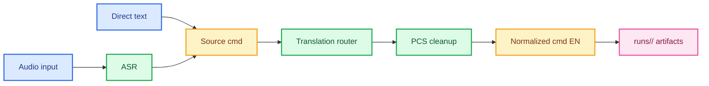

<div align="center">
    <h1>iVoice</h1>
    <p>Local-first command normalization foundation for audio and text driven speech workflows.</p>
    <a href="https://www.python.org/">
        
    </a>
    <a href="./config.toml">
        
    </a>
    <a href="https://huggingface.co/facebook/m2m100_418M">
        
    </a>
    <a href="https://huggingface.co/1-800-BAD-CODE/xlm-roberta_punctuation_fullstop_truecase">
        
    </a>
    <a href="https://github.com/SYSTRAN/faster-whisper">
        
    </a>
    <a href="./config.toml">
        
    </a>
    <a href="./config.toml">
        
    </a>
    <a href="./config.toml">
        
    </a>
    <a href="./config.toml">
        
    </a>
</div>

<p></p>

<div align="center">
    
</div>


## Overview

`iVoice` is the command-understanding layer for a future instruction-driven speech generation system.

Today the repository focuses on one job: turn user intent into a normalized English command that a downstream voice model can consume reliably.

The current pipeline supports two input modes:

- `audio -> ASR -> source text -> translation routing -> PCS -> normalized English command`
- `text -> translation routing -> PCS -> normalized English command`

The final normalized command is persisted locally together with source artifacts, metadata, and span-level diagnostics.


## Current Pipeline



Key properties:

- local-first runtime after model installation
- routed translation with pair-specific and multilingual fallback models
- conservative mixed-language normalization via span analysis
- optional punctuation/capitalization/segmentation post-processing
- shared service layer for desktop, CLI, web, and API


## What iVoice Produces

Each run is stored in its own directory under `runs/` and writes command-oriented artifacts:

- `source.txt` — original user command text
- `command.en.txt` — normalized English command
- `command.spans.json` — span-level normalization details
- `metadata.json` — runtime metadata and model diagnostics


## Functional Coverage

| Area | Current behavior |
| --- | --- |
| Audio input | Microphone capture in desktop and web, local WAV ingestion, stored in per-run artifacts |
| Direct text | First-class normalization in desktop UI, CLI, and API |
| ASR | `whisper` family via `faster-whisper` |
| Translation | Routed `opus_mt` / `m2m100` English normalization |
| PCS | Lightweight cleanup plus optional punctuation/truecasing post-processing |
| Interfaces | PySide6 desktop UI, Typer CLI, Streamlit web app, FastAPI API |
| Storage | Local caches in `data/models/<task>/<family>`, runs in `runs/` |


## Installation

Recommended setup:

```bash
source setup.sh base
ivoice-install-model configured
ivoice-desktop
```

Profiles:

- `source setup.sh base` -> `asr,translation,pcs,desktop,web,api`
- `source setup.sh desktop` -> `asr,translation,pcs,desktop`
- `source setup.sh web` -> `asr,translation,pcs,web`
- `source setup.sh api` -> `asr,translation,pcs,api`
- `source setup.sh dev` -> full runtime plus `dev`

Manual install:

```bash
python3 -m venv .venv
source .venv/bin/activate
pip install -e ".[asr,translation,pcs,desktop,web,api]"
```


## Model Installation

All managed model caches live under:

```text
data/models/<task>/<family>/
```

Install everything declared in [`config.toml`](./config.toml):

```bash
ivoice-install-model configured
```

Install a specific ASR model:

```bash
ivoice-install-model asr \
  --family whisper \
  --provider faster_whisper \
  --model-name base
```

Install a specific translation model:

```bash
ivoice-install-model translation \
  --family opus_mt \
  --provider transformers \
  --model-name Helsinki-NLP/opus-mt-ru-en \
  --source-language ru \
  --target-language en
```

Install the PCS model:

```bash
ivoice-install-model pcs \
  --family punctuation \
  --provider transformers \
  --model-name 1-800-BAD-CODE/xlm-roberta_punctuation_fullstop_truecase
```


## Running

### Desktop

```bash
ivoice-desktop
```

Desktop currently supports:

- audio mode
- text mode
- source command editing
- normalized command panel
- details diagnostics

### CLI

```bash
ivoice-cli transcribe-file /path/to/audio.wav
ivoice-cli transcribe-last
ivoice-cli normalize-text "say this softly with urgency"
```

### API

```bash
ivoice-api
curl http://127.0.0.1:8000/health
curl -X POST "http://127.0.0.1:8000/transcribe/file?language=ru" \
  -F "file=@/path/to/audio.wav"
curl -X POST http://127.0.0.1:8000/normalize/text \
  -H "Content-Type: application/json" \
  -d '{"text":"say this softly with urgency","language":"en"}'
```

### Web

```bash
ivoice-web
```

The Streamlit app currently exposes the audio path and the shared normalization backend. Direct text mode is not wired there yet.


## Configuration

Runtime configuration lives in [`config.toml`](./config.toml).

Important rules:

- language labels are normalized to short forms like `en`, `ru`, `sv`
- translation routes are matched in ascending `priority`
- `pcs` runs after English normalization and refines punctuation/casing
- `model_path` overrides the managed cache for a task
- `local_files_only = true` enforces offline-only runtime loading

You can override the config path per process:

```bash
VOICE_APP_CONFIG=/path/to/config.toml ivoice-desktop
```


## Runtime Artifacts

Example run layout:

```text
runs/
  20260419_010203_ab12cd34/
    input.wav
    source.txt
    command.en.txt
    command.spans.json
    metadata.json
```

`metadata.json` now reflects the command pipeline directly:

- source modality and source text
- resolved language and its source
- normalization status
- translation runtime details
- PCS runtime details
- artifact paths


## License

This project is distributed under the [MIT License](./LICENSE).
